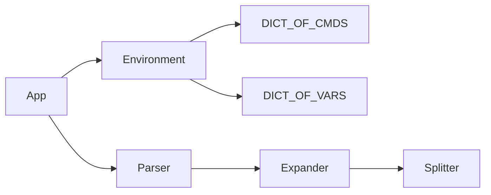

# Архитектурное описание

## Классы
- App
- Environment
- Parser
- Expander
- TextQuote
- Cmd
- MetaCmd
- Splitter
## Объекты
- DICT_OF_CMDS
- DICT_OF_VARS
##  Функции
Все команды реализованы как функции от параметров, входного выходного потока и окружения.
## Описание архитектуры
Класс App создает себе Environment, инициализируя его DICT_OF_CMDS и DICT_OF_VARS.
После этого повторяется один и тот же процесс.
### Цикл
- App считывает строку и передает ее в Parser.
- Parser сначала хочет произвести подстановку, поэтому передает данные в Expander.
- Expander вызывает splitter, чтобы отделить данные в кавычках.
- Expander производит подстановку переменных.
- Parser разделяет выражения по '|'
- Parser формирует большую команду для выполнения
- App выполняет команду полученную от парсера
## Диаграмма архитектуры

